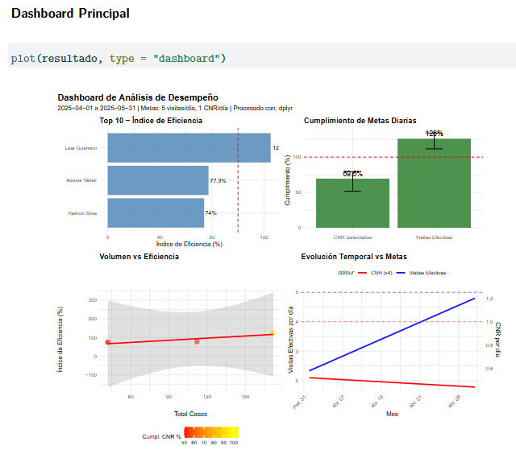
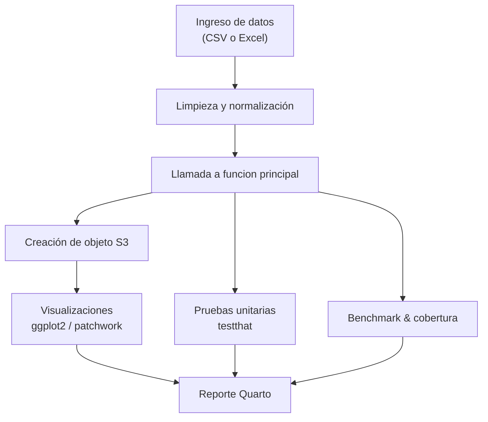

# Análisis de Desempeño en Detección de Pérdidas Eléctricas (CNR)

> **Versión:** v6 · **Autor:** Gustavo Astudillo P.
> **UDLA** (ACI1018EL) Programacíon en R.
> Quarto + R (tidyverse / data.table) · Cobertura 94 %

  

## Descripción

Este repositorio contiene el _workflow_ completo para analizar la eficacia de los técnicos en la detección de **Consumos No Registrados (CNR)**:

* Carga y limpieza de datos
* Función `analizar_desempeno_perdidas()` (vector · matriz · data frame)
* Detección de anomalías (Tukey / Z-score)
* Tests unitarios `testthat` + fuzz-testing (≈ 900 + cases)
* Cobertura de código > 92 % con **covr**
* Benchmark `microbenchmark` dplyr vs data.table  
* Documento **Quarto PDF/HTML** con dashboard y conclusiones   

## Arquitectura del análisis

